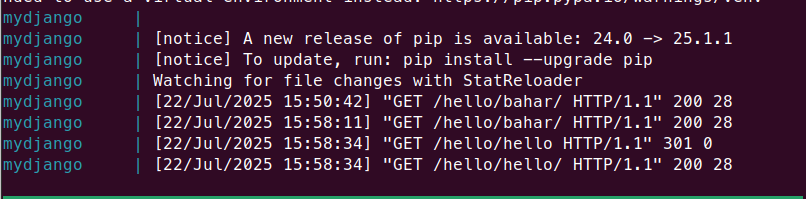

# Django Docker Compose Practice

This is a simple Django project connected to PostgreSQL using Docker Compose.  
Nothing fancy here — just me practicing Docker Compose, environment variables, and how to get a Django app talking to a database inside containers.

---

## What’s inside?

- A basic Django app running inside Docker  
- PostgreSQL running in a separate container  
- Environment variables managed with a `.env` file  
- Easy to spin up and tear down with `docker compose up`

---

## Why?

Because sometimes the best way to learn is to build something small, make mistakes, fix them, and have fun along the way!  
No production magic here — just my playground for Docker + Django.

---

## Quick Start

Just run `docker compose up --build` and visit `http://localhost:8000/hello/YourName/` to see it in action.

---

## Note
- If port 5432 is busy on your machine, tweak it in `docker-compose.yml`.  
---

Enjoy the ride! 🚀

